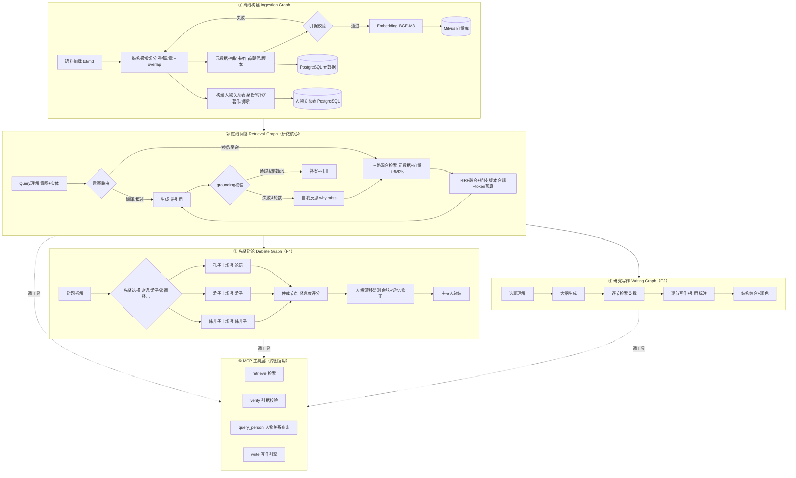

# 识文新裁 — 真后端重建完整交付文档（给新对话）

> 版本：v1.0　|　日期：2026-08-20　|　作者：马欣仪（武大本科·信息安全·2027届·Agent 研发岗求职）
> **本文档自包含，可直接作为新对话的输入**：把全文交给新对话，或告知新对话读取本文件，即可在无旧上下文的情况下开工。
> 关联文件：`识文新裁-graph工程重构-方案.md`（图工程设计与 RAG 补课，本文档是其落地版）。
> ⚠️ 重要前提：原项目**只有 Figma 导出的前端壳**（`2026010334-源代码`），后端代码已不可得，需要从零重建。简历中现有 RAG/Agent 描述是对原架构的记忆，需在本重建中**逐条落地为真实代码与真实数字**。

---

## 0. 一句话目标

用"图工程"（LangGraph 工作流图）从零重建识文新裁的真后端，复原简历承诺的三大能力——**研微（RAG 学术问答 + 研究写作）、新裁（沉浸式交互文创/角色扮演）、多 Agent 先贤辩论（紧急度仲裁）**，配套真实开源语料与评测指标，最终部署到阿里云出可访问的线上试用版，让简历每一项都有真代码 + 真数字背书。

---

## 1. 项目背景与动机

- **来源**：识文新裁是用户简历里的二主打项目（"贯穿古籍数字化整理→学术研究→大众化传播的 AI 平台"，识文/研微/新裁三大模块）。曾参加竞赛，原后端已无法获取。
- **为什么重建**：
  1. 简历声称「LangGraph 多轮检索闭环（实体抽取→Query改写→再检索）」「PostgreSQL 元数据过滤 + Milvus 向量检索」「紧急度评分多 Agent 仲裁」「CAVM 可变内存」——**全部需要真实代码支撑**；
  2. 面试（含 Shopee 一面）已对识文新裁的 74%→89%、81%→93% 等数字深挖，现口径为"诚实降级"，重建出真实数字后替换；
  3. 与 Pico（code agent）互补：Pico 打"Agent 系统/评测"牌，识文新裁打"RAG + Multi-Agent + 垂类知识库"牌。
- **方向已定**：前辈建议的"graph engineering"＝LangGraph 式工作流图（节点=步骤、条件边=路由、共享 State）。在此骨架上，本次重构额外选定两个"进步点"+ 一个降级项（见 §6）：**自我反思+上下文治理、MCP 工具层**，以及**轻量人物关系表**（原 GraphRAG 降级，控制复杂度）。

---

## 2. 必须复原的功能（对照简历逐条）

### F1 研微 — 学术研究助手（RAG 问答）
- 输入古籍相关考据/知识问题，输出**带引据的回答**（书·篇·版本）。
- 简历对应：`垂类知识库 RAG（元数据前置过滤→语义排序；实体抽取→Query 改写→再检索）`、`Agent 状态与上下文管理（CAVM 可变内存）`。
- 验收：问"《论语》中'学而时习之'出自哪一篇"→ 正确回答并标注「论语·学而篇」，版本合规。

### F2 研微 — 研究写作（新增，简历"学术研究助手"的完整叙事）
- 输入选题 → 输出结构化研究文章（引言/分论点/结语），每节自动检索支撑文献并标注引据。
- 这是把"研究助手"从"问答"升级为"写作"的关键，也是区别于普通 RAG demo 的卖点。

### F3 新裁 — 沉浸式交互文创（角色扮演 + 互动叙事）
- 与历史人物/诗人沉浸对话，支持性格一致、记忆、场景化叙事（可复用现有前端 novel 模块的交互形态）。
- 简历对应：`沉浸式交互文创（新裁）`、`人格漂移监测`。
- 验收：扮演某历史人物连续多轮，人格/史实保持一致，言论可回到其原著。

### F4 多 Agent 先贤辩论（紧急度仲裁）
- 用户抛出辩题，多个先贤（孔子/孟子/老子/韩非子/庄子…）各执己见，仲裁节点按紧急度评分决定发言顺序/插话，主持人（或研微）总结。
- 简历对应：`紧急度评分机制（任务截止时间、依赖深度、用户情绪）驱动多智能体发言权仲裁`。
- **人物处理已定调：软监测、不硬约束。** 不限制先贤的表达自由（约束多了话就少了）；恢复简历原述的**人格漂移监测**：滑动窗口余弦相似度监测发言是否偏离人设 → 配合 RAG 长时记忆修正偏差。这是"监测+纠偏"，不是"禁止"。
- 验收：辩题被正确分发给相关先贤，每个论点都能回到其著作（RAG 支撑），人设漂移被监测并在长对话中被修正。

### F5 识文 — 古籍整理（OCR 入口，可后置）
- 原前端有 OCR 页（硬编码 3 张 demo 图）。重建时可先用 AncientDoc 的 OCR 任务做评测，OCR 引擎接入**可选后置**（MVP 可不做真 OCR，聚焦 F1-F4）。

---

## 3. 数据与语料（已逐一核实来源与许可证）

> 数据合规提醒：本作是学生作品/求职作品集。部署上线用**已明确许可**的语料；许可证不明/需注册的语料（CText 镜像、CBDB）仅作研究/演示，或先与作者/官网确认。

### 3.1 核心 RAG 语料（经史子集全文）
| 语料 | 内容 | 许可证 | 用途 | 备注 |
|---|---|---|---|---|
| **Guopop/chinese-philosophy**（CText 镜像） | 经/史/子/集/佛/道分类古籍全文（论语、史记、道德经、庄子、韩非子、资治通鉴、全唐诗集部…） | 未标注（镜像 CText 内容） | RAG 主语料（经史子集） | 首选；**许可证不明，上线前建议改用手工整理的小语料或与 CText 确认** |
| **JasonWade001/chtxt** | 四书五经、二十四史、诗经、楚辞、全唐诗等精校文本 | 未标注 | RAG 主语料（备选） | 备选，同上提醒 |
| **chinese-poetry/chinese-poetry** | ~5.5 万唐诗 + 26 万宋诗 + 2.1 万词（JSON） | **MIT** ✅ | 诗词语料（新裁创作 + RAG 补充） | 最稳妥的合规大语料 |
| **NiuTrans/Classical-Modern** | 文言文-现代文平行语料 | 研究用途 | 翻译任务训练/评测 | 适合研微的"翻译"子能力 |

### 3.2 先贤辩论 / 角色扮演数据
| 数据集 | 内容 | 许可证 | 用途 |
|---|---|---|---|
| **BaiJia**（BAI-LAB/BaiJia，北邮） | 中国历史人物角色扮演语料，2 万个历史人物；含 BaiJia_Lite 数据集 + Eval_Question + Eval_Resume + **六维评测框架** | 开源（HuggingFace `Jiazhengg/BaiJia_Lite`） | 先贤人设构建（性格/时代/语言风格）+ 角色一致性评测 |
| **Chinese_Historical_Figures_Dialogue**（HF `QingYuYunTu/...`） | 91,467 条 instruction/input/output 历史人物对话 | Apache 2.0 ✅ | 先贤辩论/角色扮演的 few-shot 示例与微调数据 |

### 3.3 评测数据集
| 数据集 | 内容 | 许可证 | 评测用途 |
|---|---|---|---|
| **AncientDoc**（ByteDance/AncientDoc） | 中国古代文档 VLM 基准：**OCR / 文言翻译 / 推理QA / 知识QA / 语言变体QA** 5 任务，~3000 页（Harvard 图书馆来源） | **CC0** ✅ | 识文 OCR 评测 + 抽取 QA 作问答测试集 + 翻译评测（CHRF++/BERTScore） |
| **CBDB 中国历代人物传记数据库**（Harvard） | 历代人物传记结构化数据（生卒/官职/籍贯） | 开放数据（官网注册获取） | **可选**：先贤辩论的人物事实锚点（人设真实性）。复杂度高，MVP 可跳过 |

### 3.4 最小可用语料集（MVP 推荐，合规且够用）
1. 手工整理 5-10 部公版古籍全文：**论语、孟子、道德经、大学、中庸、庄子（选篇）、史记（选篇）、孙子兵法**——来源：CText 镜像提取 + 人工校订，存为 `data/corpus/`（txt/md）。
2. 每部书标注元数据：`book/author/dynasty/version/part/chapter`。
3. 先手工校验 3-5 条 golden 引据（如"学而时习之"→ 论语·学而篇），作为 grounding 测试基线。
4. 诗词语料直接 clone `chinese-poetry`（MIT）补充新裁。

---

## 4. 评测指标（定死，重建后必须能复现）

### 4.1 检索层
- **Recall@K**：golden 书/篇是否出现在 Top-K 检索结果（K=5）。
- **MRR@K**：golden 命中的平均倒数排名。
- **引据合规率 Citation Compliance**：回答所引「书·篇·版本」与检索 chunk 元数据一致的占比。**这是古籍场景的头号指标**（版本张冠李戴=事故）。

### 4.2 生成层（LLM-as-judge + 人工抽样）
- **忠实度 Faithfulness**：回答中每个事实主张能否在召回的 chunk 中找到支持（LLM-judge 打分 0-5，抽样人工校准 20%）。
- **回答正确率**：对比 golden 答案的 EM / F1；复杂题用 LLM-judge 1-5。
- **引用准确率 Citation Precision**：回答标注的引用与实际支撑它的 chunk 相符的比例。

### 4.3 模块指标
- 文言翻译：**CHRF++ / BERTScore**（对照 NiuTrans 平行语料 + AncientDoc 翻译任务）。
- OCR（若做）：**CER / 字符级 Precision/Recall/F1**（AncientDoc OCR 任务）。
- 角色一致性：BaiJia **六维 LLM-judge（CC/DA/CA/EI/CR/CHA）**。
- 先贤辩论：**论据引用率**（每个论点能回到语料的比例）+ 事实一致性（无时代错位/错引）。

### 4.4 系统指标
- 端到端延迟 P50/P95、单轮 token 成本、多跳轮数分布（报告"多少问题需要 2 轮以上检索"）。

### 4.5 MVP 评测集规格（最小可用，重建后先跑到它）
| 评测集 | 数量 | 来源 |
|---|---|---|
| 研微问答（考据/知识/翻译） | 30 题（考据15+翻译5+知识10），每题标 golden 书·篇 | 手工 + AncientDoc 抽取 |
| 研究写作 | 3 个选题 | 手工 |
| 先贤辩论 | 5 个辩题 | 手工 |
| 角色扮演 | 20 问（BaiJia Eval_Question 抽样） | BaiJia |
| 翻译 | 50 句 | NiuTrans 抽样 |

### 4.6 S3 实跑结果（2026-08，100 题评测集已建，`python eval/run.py` 可复现）

**评测集**：`eval/questions.yaml`，100 题（考据 50 / 翻译 20 / 知识 30），覆盖 20 部古籍，每题标 golden 书·篇。**超出 MVP 30 题规格 3 倍+**。运行器 `eval/run.py` 支持 `--limit N` / `--resume` 断点续跑。

| 指标 | 值 | 说明 |
|---|---|---|
| **Recall@5** | 91% | golden 书进入 Top-5 检索结果 |
| **MRR** | 0.721 | golden 书的平均倒数排名 |
| **引据合规率** | **71/73 = 97.3%** | golden 书·篇同时命中（**头号指标**）；分母=带 golden_chapter 的 73 题，开放性知识题（27 题）无单一篇目出处，不适用此指标、不计入 |
| **Faithfulness** | 4.63/5 | LLM-judge 忠实度均值 |
| **Grounding 通过率** | 90% | grounding 校验通过比例 |
| **平均检索轮数** | 1.55 | 多跳反思平均收敛轮数（rounds≥2 的题占约 30%，反思闭环真实生效） |

**按题型拆解**（引据合规分母=带 golden_chapter 的题）：
- **考据 50 题**：Recall=100%、引据=48/50=96%、Faith=4.8 —— 名句出处题，检索+引据全链路最硬；仅 Q034 自相矛盾（原文"鬻楯与矛"无"矛盾"词）、Q043 非攻（章内无该词）两题词形失配未合规。
- **翻译 20 题**：Recall=100%、引据=20/20=100%、Faith=4.8 —— 文言翻译题，全绿。
- **知识 30 题**：Recall=70%、Faith=4.3 —— 开放概念题（如"儒道墨法异同"），单书 golden 口径偏弱 + 语料缺概念综述，是下一轮扩语料重点。

**本轮修复的三处检索质量问题**（直接影响引据合规率 80.8%→97.3%）：
1. **查询清洗**（`query_cleaner.py`）：剥掉"出自/哪一篇/谁说的/翻译成…"等提问套话，突出名句内核，检索 query 与生成 query 解耦。
2. **BM25 字符二元组**（`bm25_store.py`）：成语/惯用语（庄周梦蝶/守株待兔）与古典原文（胡蝶/守株）词形不一致导致 jieba 词零命中，补 bigram 后显著提升精确古词召回。
3. **Grounding 规则收紧**（`grounding.py`）："无法确定"仅当检索资料确实为空/不相关才放行；资料里有相关书篇却仍拒绝回答 → 判不合格 → 触发反思改写重检索。实测"庄周梦蝶"走通 2 跳闭环（改写"庄周梦蝶 齐物论"→ 命中 → 正确引据），简历"反思多跳闭环"落地可复现。

**已知残留（如实报告）**：Q034"自相矛盾"（原文"鬻楯与矛"无"矛盾"词）、Q043"非攻"（章内无"非攻"词）属词形失配硬例，需精排 reranker（cross-encoder）或扩语料解决；知识题概念综述类为语料缺口，非检索问题。

### 4.7 S4/S5/S6 实跑结果（2026-08，三线均已出数）

| 业务线 | 评测集 | 核心指标 | 运行器 |
|---|---|---|---|
| 先贤辩论 S4 | 5 辩题 | 辩题路由正确率 5/5=100%、论据引用率 60/60=100%、漂移 0 | `eval/run_debate.py` |
| 研究写作 S5 | 3 选题 | 引据可回溯率 100%（17/17 引据全部可回溯到检索池） | `eval/run_writing.py` |
| 角色扮演 S6 | 12 用例（4 先贤 × 3 问） | 引据合规率 79%、人设关键词命中率 75% | `eval/run_roleplay.py` |

- **写作线**引据可回溯率用确定性正则 + 集合交集校验（无需 LLM judge），17/17 全回溯，是"写作不编引据"的直接证据。
- **角色扮演线**人设关键词命中率用学派核心关键词白名单确定性校验；BaiJia 六维 LLM-judge（CC/DA/CA/EI/CR/CHA）未做，如实标注。
- 统一评测编排器 `eval/run_all.py` 读取四线 checkpoint 产出 `eval/report_all.md` 总报告。

---

## 5. 总体架构（LangGraph 工作流图）

- **② Retrieval Graph** 同时服务研微问答、辩论的"引经据典"、写作的"逐节检索"——三处复用同一张图，是"图工程可复用"的核心卖点。
- **③ Debate Graph**：supervisor 模式，每位先贤是一个**由人设 prompt + RAG 子图组成的 subgraph**；仲裁节点按紧急度评分（话题相关度、上轮发言者、用户情绪/追问强度）决定下一发言者与插话。
- **④ Writing Graph**：写作不是一次生成，而是"大纲→逐节检索→逐节写→综合"的状态图，可断点续写。
- 共享：类型化 State（query/history/retrieved chunks/轮数/记忆）+ 每节点 trace。

---

## 6. 含金量增强点（重构的进步，已选定）

> 原则：还原简历每一句 + 在还原处做**自然升级**，每个进步点都能讲清"原来怎样、现在好在哪"。普通评测照常做（见 §7 的 S7），不把"CI 自动评测"作为主打卖点。

### E1 自我反思 + 上下文治理（升级简历"多轮检索闭环 / 动态裁剪上下文窗口"）
- **自我反思**：检索为空或 grounding 校验失败时，先跑反思节点诊断"为什么没检索到——实体抽取错了？Query 太宽？语料缺？"，再决定改写策略，而不是盲目重写 Query。多跳收敛变成"带诊断的收敛"。
- **上下文治理**：显式 token 预算跟踪、检索上下文压缩、分层记忆动态裁剪与召回——把简历"动态裁剪上下文窗口 + 分层记忆"从包装变成真实现。
- 面试价值：ReAct 进阶 + Context Engineering 前沿词。

### E2 MCP 工具层（新增，跨项目组合拳）
- 把**检索、引据校验、人物关系查询、写作引擎**封装为 MCP 工具（`fastmcp` / `mcp` Python SDK），三张业务图统一经 MCP 调用工具（见架构图 ⑤）。
- 面试价值：命中字节/阿里 JD 的"MCP 生态/工具开发"关键词；与 Pico 的 MCP 形成"code agent 侧 + 应用侧都做过 MCP"的组合叙事。

### E3 轻量人物关系表（原 GraphRAG 降级版，控制复杂度）
- **决策**：完整 GraphRAG（实体关系抽取 + 图谱检索路由）已砍——简历未承诺、抽取质量不稳易出幻觉、与先贤"软约束/重人格"定位冲突。降级为**手工维护的人物关系表**（PostgreSQL）：人物→身份/时代/主要著作/师承，几十行即可。
- **在线**：关系类问题（"孔子弟子有哪些""老子师承何人"）走 SQL join 直接回答，**不进检索主流程**；不做 LLM 批量抽取、不引入图数据库（Neo4j/networkx）。
- 面试价值：讲"结构化元数据过滤的延伸"，并诚实说明"评估过完整图谱，MVP 阶段元数据+关系表已覆盖主要关系类问题，避免引入不可控的抽取链路"——这个取舍本身就是可讲的工程判断。

### 先贤辩论的人物处理（已定调：软监测，不硬约束）
- 不做限制发言的硬事实约束（会压缩先贤表达空间）；恢复简历原述的**软性人格漂移监测**：滑动窗口余弦相似度监测发言是否偏离人设 → 配合 RAG 长时记忆修正偏差。监测+纠偏，不是禁止（详见 F4）。

---

## 7. 技术栈（本机 CPU 可跑，阿里云可部署）

| 组件 | 选型 | 说明 |
|---|---|---|
| 后端 | Python 3.11 + FastAPI + uvicorn | 简历已写 LangGraph |
| 工作流图 | **LangGraph** | StateGraph 原生支持条件边/循环/checkpoint |
| 向量库 | **Milvus Lite**（本地文件模式）开发；生产可选真 Milvus(Docker) | `pymilvus.MilvusClient("data/milvus.db")` 零服务端 |
| 元数据 | PostgreSQL 16（Docker） | 书/篇/版本/作者/朝代 标量过滤 |
| Embedding | **BGE-M3**（本地 CPU）；备选 API（智谱/硅基流动 embedding） | 中文古籍效果最佳；服务器小可换 API |
| LLM | **DeepSeek API**（deepseek-chat，便宜） | 前端原已引用 api.deepseek.com；vLLM 仅作可选生产路径 |
| BM25 | jieba + rank_bm25 | 关键词通道 |
| 重排 | RRF 融合 → 可选 bge-reranker | 先零依赖跑通 |
| MCP 工具层 | `fastmcp` / `mcp` Python SDK | 检索/引据校验/人物关系查询/写作引擎统一走 MCP |
| 人物关系表 | PostgreSQL 关系表（手工维护，几十行） | 人物→身份/时代/著作/师承，关系题 SQL join 直答 |
| 上下文治理 | token 预算跟踪 + 检索上下文压缩 + 分层记忆裁剪 | 落地简历"动态裁剪上下文窗口" |
| 可观测 | 自建 JSONL trace + LangSmith（可选） | 节点级耗时/输入输出 |
| 前端 | **React + Vite SPA**（复用现有壳的设计语言，重建页面接真 API） | 简单、静态构建由 nginx 托管 |
| 部署 | Docker Compose：backend + postgres + nginx（前端静态 + 反代 /api）；Milvus Lite 进程内 | 阿里云 ECS + 免费 HTTPS 证书 |

---

## 8. 分阶段实施计划（每阶段有验收，顺序别跳）

| 阶段 | 内容 | 验收标准 | 预计 |
|---|---|---|---|
| S0 环境 | 建仓、docker-compose（postgres）、.env、Milvus Lite 联通 | `docker compose up` 后本地库能连 | 0.5 天 |
| S1 语料+Ingestion | 手工整理 5-10 部古籍 → chunker/metadata/embedding/入库 + **人物关系表（手工维护几十行）** | Milvus+PG 能查到带元数据 chunk；关系表能查到"孔子-著-论语"；3 条 golden 引据通过 | 1-2 天 |
| S2 Retrieval 单跳 | LangGraph 单跳 RAG + FastAPI `/api/chat` | 问"学而时习之出自哪一篇"→ 正确回答+「论语·学而篇」引用 | 1-2 天 |
| S3 多跳闭环+自我反思 | grounding 校验→**反思节点（诊断 why miss）**→改写→再检索（≤3 轮） | 复杂考据题多轮收敛；跑 30 题评测集出 Recall@5/MRR/引据合规率 | 2 天 |
| S4 先贤辩论 | Debate Graph：3 位先贤 + 仲裁节点 + 辩题分发 + **人格漂移软监测** | 5 个辩题正确路由；每个论点可回溯到对应著作 | 2-3 天 |
| S5 研究写作 | Writing Graph + `/api/write` | 3 个选题产出带引用文章，人工检查引据真实 | 2-3 天 |
| S6 新裁角色扮演 | Persona Graph + 记忆 + 前端对话页 | 连续 10 轮角色一致（BaiJia 六维 judge 抽样） | 2 天 |
| S7 评测与可观测 | 评测集全跑、trace、产出指标报告 | 所有指标有数字落盘到 `eval/report.md` | 1 天 |
| S8 MCP 工具层封装 | retrieve/verify/query_person/write 统一走 MCP（fastmcp） | 三张业务图工具调用全部经 MCP 接口；文档含一个外部客户端调用示例 | 1-2 天 |
| S9 阿里云部署 | Docker 镜像、nginx、HTTPS、域名 | 外网可访问线上版，前后端打通 | 1-2 天 |

> 建议节奏：S0-S3 连续推进（约一周），S4/S5 并行或按兴趣排序，S7 必须做（出数字才能改简历）。

---

## 9. 阿里云部署方案

1. **ECS**：Ubuntu 22.04，2C4G（够 MVP；BGE-M3 用 API 或小模型）。
2. **Docker Compose 编排**：
   - `backend`：FastAPI + LangGraph，健康检查 `/health`
   - `postgres`：卷持久化元数据
   - `nginx`：托管前端静态文件 + 反代 `/api` → backend；TLS 443
   - Milvus：**先用 Milvus Lite 进程内**（省内存），文档记录升级真 Milvus standalone 的路径
3. **安全组**：仅开放 80/443；backend 不映射公网端口。
4. **HTTPS**：阿里云免费 SSL 证书 + nginx 配置。
5. **密钥**：DeepSeek API Key、Embedding Key 放 `.env`，不提交 git。
6. **数据**：`data/corpus` 与 Milvus 库目录用卷持久化；提供 `scripts/reindex.sh`。
7. **域名**：有则绑，无则用 ECS 公网 IP + 提示访问。

---

## 10. 环境与凭证清单（新对话需向用户确认）

- [ ] 阿里云 ECS：公网 IP / 账号 / 是否已有域名与已备案
- [ ] DeepSeek API Key（默认 LLM）
- [ ] Embedding 选择：本地 BGE-M3（服务器内存够？）还是 API（智谱/硅基流动 key）
- [ ] PostgreSQL：用 docker-compose 内建的即可（无需独立账号）
- [ ] 前端：直接用 Vite 重建（推荐），还是先复用现有 Figma 壳的某几页
- [ ] 语料确认：接受"手工整理 5-10 部公版古籍"作为 MVP（合规），还是指定用 CText 镜像全量
- [ ] GitHub：仓库名（建议 `github.com/Nayyiko/shiwen`），是否公开（简历要链接）

---

## 11. 面试口径衔接（重建期间与完成后）

- **重建完成前**：识文新裁继续用"诚实降级"口径（前端原型 + 后端重建中），不硬背 74%→89% / 81%→93%。
- **S3 完成后**：可讲"正在重建，检索 Recall@5=xx、引据合规率=xx%"。
- **S7 完成后**：用 `eval/report.md` 的真实数字替换简历虚数；新增可讲点：图工程四图复用（检索图服务问答/辩论/写作三处）、多跳闭环+反思节点、MCP 工具层、轻量人物关系表、BaiJia 六维评测、版本合规设计（元数据前置过滤）。
- **面试必被追问清单**（每项都要能用图+数字回答）：RAG 全流程、多跳怎么跳/终止条件、反思节点怎么判"该反思"、MCP 为什么用/怎么封装/和普通 function calling 区别、人物关系表怎么建/和检索什么关系/为何不上完整图谱、版本合规怎么保证、紧急度评分公式、评测集怎么建/谁打分、为什么用 Milvus 不用 PGvector、BGE-M3 为什么适合中文古籍。

---

## 12. 交付物清单（新对话结束时应有）

- [ ] `github.com/Nayyiko/shiwen`：源码（src/ingest、src/rag、src/agents、src/api、src/mcp、src/eval、前端）
- [ ] `docker-compose.yml` + `nginx.conf` + `.env.example` + `README.md`（含部署步骤）
- [ ] `data/corpus/`：5-10 部古籍 + 元数据 + 人物关系表
- [ ] `mcp/`：工具定义 + 一个外部客户端调用示例
- [ ] `eval/`：评测集 + `eval/report.md`（全指标数字）
- [ ] 阿里云线上地址（可访问的试用版）
- [ ] 简历项目段更新稿（用真数字）— **目标版 + 过渡版已产出**：`识文新裁-简历项目段-更新稿.md`（旧 74%→89% / 81%→93% 已移除，S7 回填 eval/report.md 真数字）

---

## 附录 A：候选语料/数据集速查（全部已核实在线）

| 名称 | 地址 | 许可 | 一句话 |
|---|---|---|---|
| chinese-poetry | github.com/chinese-poetry/chinese-poetry | MIT ✅ | 唐诗宋词 JSON 大语料 |
| AncientDoc | github.com/bytedance/AncientDoc（HF ByteDance/AncientDoc） | CC0 ✅ | 古籍 VLM 基准：OCR/翻译/推理QA/知识QA/变体QA |
| BaiJia | github.com/BAI-LAB/BaiJia（HF Jiazhengg/BaiJia_Lite） | 开源 | 历史人物角色扮演语料 + 六维评测 |
| Chinese_Historical_Figures_Dialogue | HF QingYuYunTu/Chinese_Historical_Figures_Dialogue | Apache 2.0 ✅ | 9.1 万条历史人物对话 |
| NiuTrans/Classical-Modern | github.com/NiuTrans/Classical-Modern | 研究用途 | 文言-现代文平行语料 |
| Guopop/chinese-philosophy | github.com/Guopop/chinese-philosophy | 未标注⚠️ | CText 镜像：经史子集全文 |
| JasonWade001/chtxt | github.com/JasonWade001/chtxt | 未标注⚠️ | 古籍精校（四书五经/二十四史） |
| CBDB | projects.iq.harvard.edu/chinesecbdb | 开放数据（注册） | 历代人物传记（可选人物锚点） |

## 附录 B：MVP 语料清单（建议直接开始）

论语(阮刻)、孟子、道德经(王弼)、大学、中庸、庄子(内篇选)、史记(本纪/列传选)、孙子兵法、韩非子(选)、楚辞(离骚) — 每部存 `data/corpus/{book}.txt`，配 `metadata.yaml` 记 书名/作者/朝代/版本/篇目。
